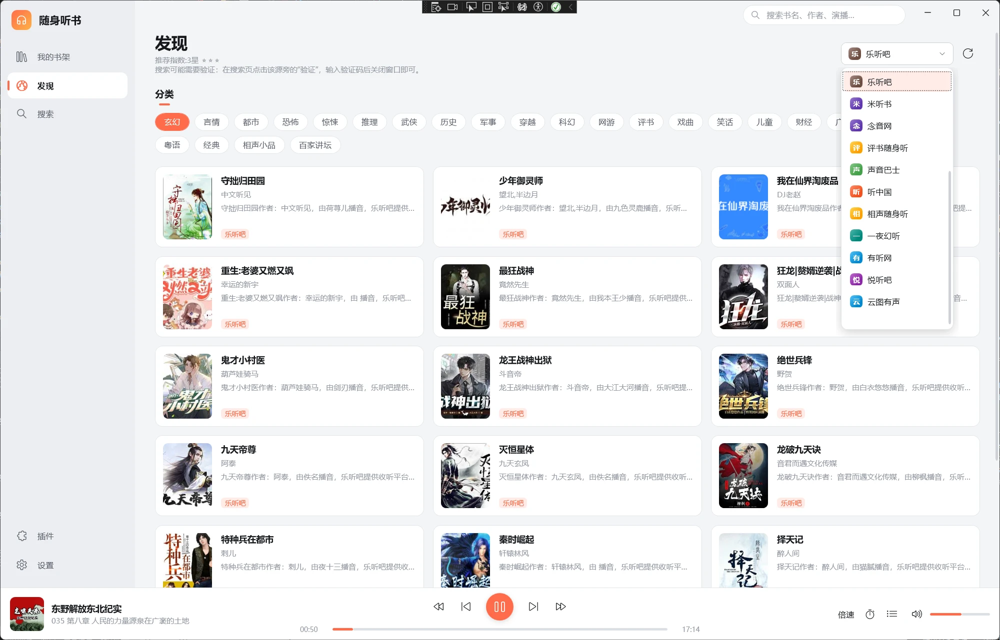
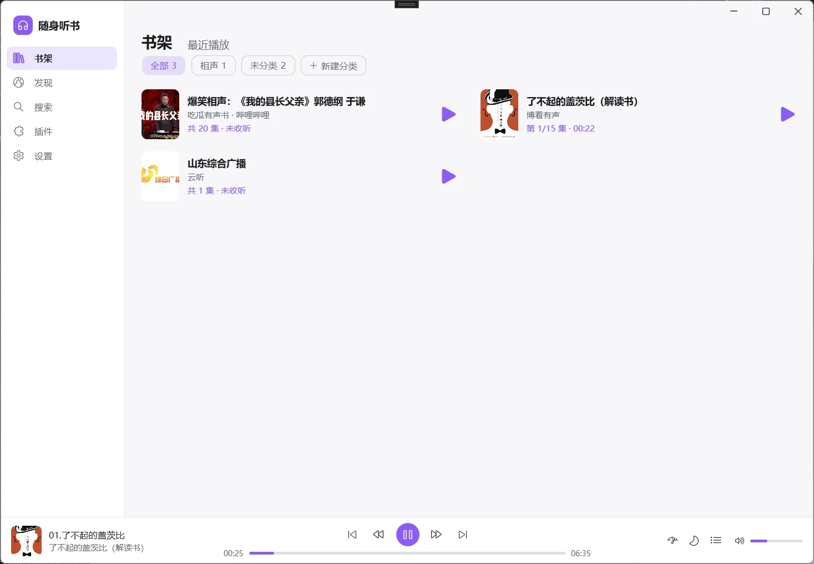
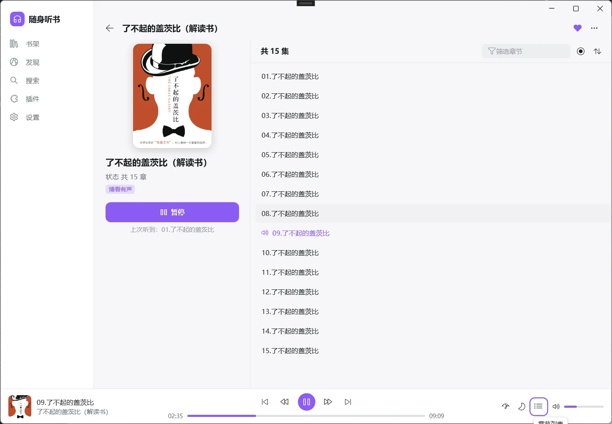

# 随身听书

参照 [eprendre/tingshu](https://github.com/eprendre/tingshu) 的自定义源机制，用 WPF 编写的 Windows 听书程序。
本程序只是播放器，不提供任何内容，所有音频都来自第三方网站，请支持正版。

## 界面预览

**发现**：按源浏览分类，点标题切换听书源；内置的“云听”可以收听各地的广播电台



**书架**：收藏的书可以分类，和最近播放分开；右边的按钮直接接着听



**详情**：左边是书的信息，右边是章节，可以筛选、定位到上次听到的地方、倒序



## 功能

- **通用插件**：程序本身不带任何听书源，所有源都来自导入的插件，一个插件可以包含多个源（[开发指南](docs/plugin-development.md)）
  - **脚本插件**：一个 zip 包，里面是 `manifest.json` 和 JavaScript 脚本，用文本编辑器就能写，导入后立即生效
  - **DLL 插件**：C# 编写，引用 TingShu.Sdk 继承 SourceBase；全部听书源都打包在 `ShunSources.Plugin` 这一个插件里
  - 支持从文件 / 网址导入，或者把 zip 直接拖进“插件”页；可以启用、禁用、排序、登录，以及一键测试和调试日志
- **广播电台**：内置“云听”，可以收听全国各地的广播电台直播；也可以自己添加电台（名称 + 直播流地址）
- **网盘**：内置夸克网盘、百度网盘、阿里云盘和 WebDAV（可以连自己的 NAS）。在“设置 → 网盘”里开启并登录成功后，才会出现在“插件”和“发现”里；每个文件夹是一本书，里面的音频是章节，可以指定只看某个目录
- **本地文件**：在“设置 → 本地文件”里开启并选择一个文件夹后，作为一个源出现；每个子文件夹是一本书，文件夹里的图片用作封面
- 发现（分类浏览、无限滚动）、**聚合搜索**（多源并发，按源筛选，需要人机验证的网站可以在程序里完成验证）、书架（支持自己建分类）和最近播放
- 播放：断点续播、自动下一集、倍速 0.5–3x、快进快退、暂停后自动回退几秒、定时关闭（按时间或按集数）、单书跳过片头片尾、章节倒序和筛选；点底部播放条可以展开播放页
- 音频提取：直链 / HTML / JSON / 正则 / **WebView 渲染** / **WebView 嗅探**；本地代理统一附加 UA、Referer、Cookie，并支持拖动进度
- 界面：浅色、深色、跟随系统，7 种主题色；自绘标题栏，Windows 11 下圆角；任务栏缩略图上有播放控制按钮和进度；关闭按钮可以设为收到右下角托盘，继续在后台播放
- **适配大部分电脑**：
  - 每显示器 DPI 感知，高分屏和多屏缩放不同时也清晰
  - 窄窗口时侧栏自动收起，卡片列数随窗口宽度变化
  - 提供 x64 / x86 / ARM64 独立部署单文件版本，目标电脑无需安装 .NET
  - 首次启动按屏幕大小设置窗口尺寸，支持便携模式

快捷键：`空格` 播放/暂停 · `←/→` 快退/快进 · `Ctrl+←/→` 上/下一集 · `Ctrl+F` 搜索 · `Alt+←` 或鼠标侧键返回 · 媒体键

## 插件开发

📖 **[插件开发指南](docs/plugin-development.md)**

插件有两种写法，可以同时安装：

**脚本插件（推荐）**：一个 zip 包，里面是 `manifest.json` 和若干 `.js`，不需要开发环境。

```json
{ "name": "MySources", "version": "1.0.0", "author": "作者名", "scripts": ["sites.js"] }
```

```js
registerSource({
  id: '0f9c0b5c2d7e4c1b9a0e6f3a2b1c4d5e',
  name: '我的站点',
  url: 'https://example.com',

  search: function (keywords, page) {
    var doc = this.host.getHtml('https://example.com/search?q=' + encodeURIComponent(keywords) + '&p=' + page);
    var books = doc.select('.item').map(function (e) {
      return { bookUrl: e.first('a').absUrl('href'), title: e.first('h3').text(), coverUrl: e.first('img').absUrl('src') };
    });
    return { books: books, totalPage: page };
  },

  bookDetail: function (bookUrl) {
    var doc = this.host.getHtml(bookUrl);
    return { episodes: doc.select('#playlist a').map(function (a) { return { title: a.text(), url: a.absUrl('href') }; }) };
  },

  audio: function (episodeUrl) {
    return this.host.getHtml(episodeUrl).first('audio').absUrl('src');
  }
});
```

把这两个文件压缩成 zip，在程序的“插件”页导入（或直接拖进去）即可。程序内置的广播电台就是用同样的方式写的。

**DLL 插件**：新建一个 .NET 8 类库，引用 `TingShu.Sdk`，继承 `SourceBase` 实现搜索、分类、详情和音频提取，编译出的 dll 在“插件”页导入。完整示例见 [sources/ShunSources.Plugin](sources/ShunSources.Plugin)。

指南包括：

- 脚本插件：插件包的结构、源的属性和方法、宿主提供的网络请求 / WebView / 配置 / 缓存、HTML 与 JSON 帮助方法
- DLL 插件：创建项目、6 种音频提取方式（直链、HTML、JSON、WebView 渲染、WebView 嗅探、自定义）
- 登录、搜索验证、设置项、增量更新章节等可选功能
- 分页章节、访问频率限制的处理，调试、打包与安装

## 目录结构

```
tingshu.sln
├─ tingshu/                  WPF 程序
│  ├─ Core/                  插件加载、网络、WebView、音频代理、播放器、书架存储
│  ├─ Drives/                内置的网盘源（夸克、百度、阿里云盘、WebDAV）和本地文件源
│  ├─ Js/                    脚本插件引擎，以及内置的广播电台脚本
│  ├─ ViewModels/  Views/    界面（MVVM）
│  ├─ Controls/  Themes/     自定义控件、浅色/深色主题与控件样式
│  └─ Properties/PublishProfiles/   win-x64 / win-x86 / win-arm64 发布配置
├─ TingShu.Sdk/              插件 SDK（SourceBase、AudioExtractor、ISourceHost……）
├─ sources/
│  └─ ShunSources.Plugin/    听书源插件（全部源，单个 DLL）
└─ docs/                     插件开发文档
```

## 构建与运行

需要 [.NET 8 SDK](https://dotnet.microsoft.com/download/dotnet/8.0)。也可以用 Visual Studio 2022 打开 `tingshu.sln`。

```bash
dotnet build tingshu.sln
```

```bash
dotnet run --project tingshu
```

## 发布

发布程序（不包含任何源）：

```bash
dotnet publish tingshu -p:PublishProfile=win-x64
```

输出在 `publish/win-x64/`，包括 `TingShu.exe`（约 64 MB，自带运行时）、`docs/`，以及给插件开发者用的 `sdk/`。

单独编译源插件，得到 `sources/ShunSources.Plugin/bin/Release/net8.0/ShunSources.Plugin.dll`，在程序的“插件”页导入：

```bash
dotnet build sources/ShunSources.Plugin -c Release
```
32 位旧电脑用 `win-x86`，ARM 笔记本用 `win-arm64`。

运行环境：Windows 10 1607 及以上 / Windows 11。WebView 类插件需要 [WebView2 运行时](https://developer.microsoft.com/microsoft-edge/webview2/)（Windows 11 和大多数 Windows 10 已自带），没有它不影响其它功能。

## 数据位置

- 默认在 `%AppData%\TingShu`：`settings.json`、`library.json`、`plugins\`、`cache\`、`log.txt`
- 程序目录下放一个 `portable.txt` 即进入便携模式，数据改为保存在程序目录的 `data\` 下

## 协议

本项目采用 [PolyForm Strict License 1.0.0](LICENSE)，版权所有 © 2026 whykang。

- 允许：查看源代码，以及个人学习、研究、娱乐等非商业用途的使用
- 不允许：修改源代码、基于本项目制作新作品（二次开发）、分发本软件、任何商业用途

在此之外，作者另行许可：可以基于 TingShu.Sdk 开发听书源插件并自行分发，插件中不得包含本项目除 SDK 接口以外的代码。
